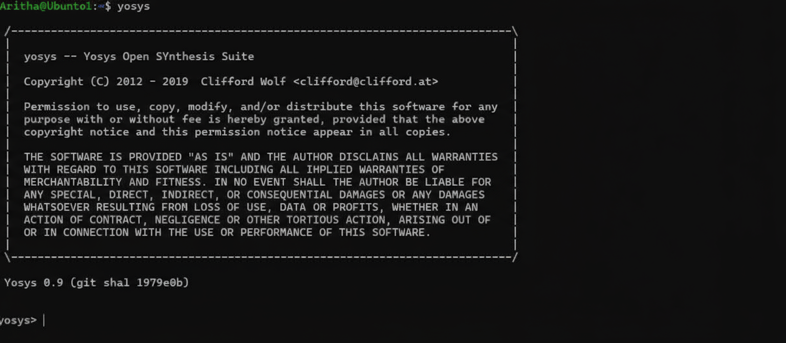
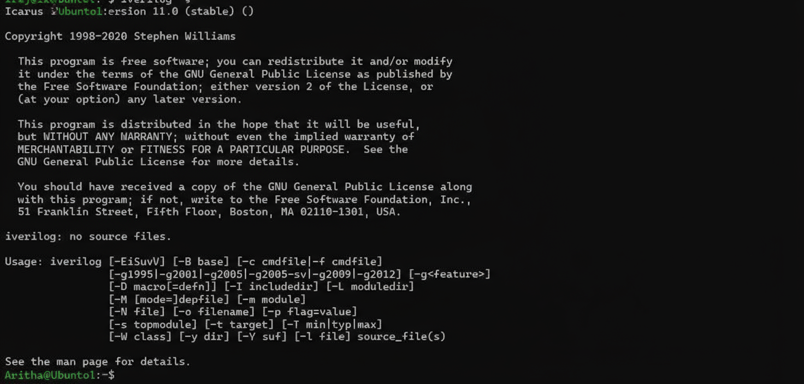
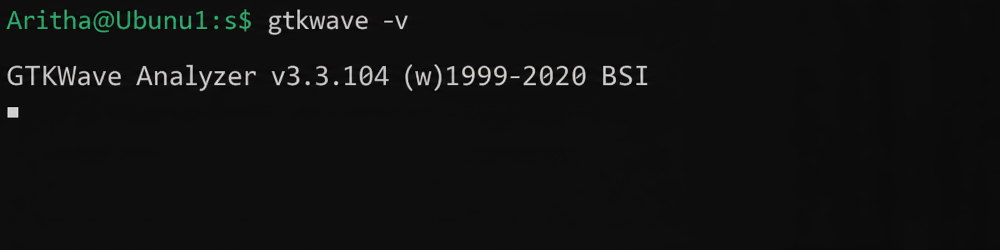

# RISC-V  SoC Tapeout Program VSD

## Tools Installation

#### <ins>All the instructions for installation of required tools can be found here:</ins>

### **System Requirements**
- 6 GB RAM
- 50 GB HDD
- Ubuntu 20.04 or higher
- 4 vCPU

### **Resizing the Ubuntu window to fit the screen**
```bash
$ sudo apt update
$ sudo apt install build-essential dkms linux-headers-$(uname -r)
$ cd /media/spatha/VBox_GAs_7.1.8/
$ ./autorun.sh
```

### **TOOL CHECK**

#### <ins>**Yosys**</ins>
```bash
$ sudo apt-get update
$ git clone https://github.com/YosysHQ/yosys.git
$ cd yosys
$ sudo apt install make               # If make is not installed
$ sudo apt-get install build-essential clang bison flex \
    libreadline-dev gawk tcl-dev libffi-dev git \
    graphviz xdot pkg-config python3 libboost-system-dev \
    libboost-python-dev libboost-filesystem-dev zlib1g-dev
$ make config-gcc
# Yosys build depends on a Git submodule called abc, which hasn't been initialized yet. You need to run the following command before running make
$ git submodule update --init --recursive
$ make 
$ sudo make install
```


#### <ins>**Iverilog**</ins>
```bash
$ sudo apt-get update
$ sudo apt-get install iverilog
```


#### <ins>**gtkwave**</ins>
```bash
$ sudo apt-get update
$ sudo apt install gtkwave
```

Day 1: Introduction to Verilog RTL Design & Synthesis

Welcome to Day 1 of the RTL Workshop! Today marks the beginning of your journey into digital design, Verilog coding, and hardware description languages. By the end of this session, you'll be able to write simple RTL modules, simulate them, and perform basic synthesis.


---

📚 Objectives

By the end of this session, participants will be able to:

1. Understand the basics of Digital Logic Design.


2. Learn Verilog HDL syntax and coding standards.


3. Perform simulation using Icarus Verilog (iverilog).


4. Conduct RTL synthesis with Yosys.


5. Analyze timing diagrams and module behavior.


---

🛠 Tools Required

Icarus Verilog (iverilog) – Open-source Verilog simulator

Yosys – Open-source logic synthesis tool

GTKWave – Waveform viewer for simulation results

Text editor or IDE (VS Code recommended)


---

📖 Topics Covered

1. Introduction to RTL Design

What is RTL?

Difference between RTL and Gate-level design

Importance of synthesizable code


2. Verilog Basics

Modules and ports

Data types: wire, reg

Operators and expressions

Procedural blocks: always, initial


3. Simulation

Writing testbenches

Compiling and running simulations with Icarus Verilog

Viewing waveforms with GTKWave


4. Synthesis

Understanding synthesis flow

Using Yosys to synthesize simple modules

Reading synthesis reports


5. Practical Lab

Design a 4-bit adder in Verilog

Simulate and verify functionality

Synthesize using Yosys


---

📂 Lab Setup
#### <ins>**clone**</ins>
```bash
$git clone https://github.com/yourrepo/RTL_workshop.git
cd RTL_workshop/Day_1

#### <ins>**run simulation**</ins>
```bash

2. Run simulation:
$iverilog -o adder_tb.vvp adder_tb.v adder.v
vvp adder_tb.vvp
gtkwave adder_tb.vcd

#### <ins>**perform synthesis**</ins>
```bash
3. Perform synthesis:

$yosys -p "synth -top adder; write_verilog adder_synth.v" adder.v


